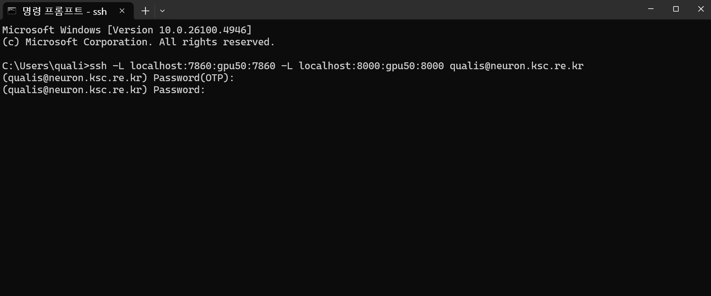
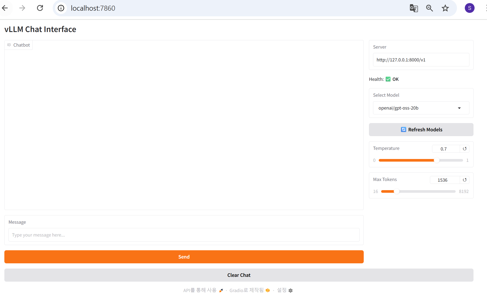

# Running GPT-OSS with vLLM on Supercomputers (SLURM + Singularity)

[](LICENSE)
[](https://www.python.org/downloads/)
[](https://github.com/vllm-project/vllm)
[](https://slurm.schedmd.com/documentation.html)
[](https://docs.sylabs.io/guides/3.5/user-guide/introduction.html)

This repository provides a complete setup for running **[GPT-OSS](https://openai.com/index/gpt-oss/)** and other Hugging Face models with **[vLLM](https://github.com/vllm-project/vllm)** on HPC clusters using **SLURM** and **Singularity**. It launches an **OpenAI-compatible REST API** and a **Gradio** web UI.

> Tested on the [**KISTI Neuron GPU cluster**](https://www.ksc.re.kr/eng/resources/neuron); steps are generic for any **SLURM-managed HPC GPU cluster**.

---

## Table of Contents

- [Highlights](#highlights)
- [Requirements](#requirements)
- [Prerequisites (SLURM HPC / KISTI Neuron example)](#prerequisites-slurm-hpc--kisti-neuron-example)
- [Quickstart](#quickstart)
- [Building the Container (details)](#building-the-container-details)
- [Host-side Environment (UI only)](#host-side-environment-ui-only)
- [The SLURM Launcher Script](#the-slurm-launcher-script)
  - [Usage](#usage)
  - [What the Script Does](#what-the-script-does)
- [Verifying the API](#verifying-the-api)
- [Switching Models & Ports](#switching-models--ports)
- [SSH Tunneling](#ssh-tunneling)
  - [Screenshots](#screenshots)
- [Troubleshooting](#troubleshooting)
- [References](#references)
- [Contributing](#contributing)
- [License](#license)
- [Acknowledgments](#acknowledgments)
- [Citation](#citation)

---

## Highlights

- **HPC-friendly:** SLURM batch script, Singularity container, SSH tunneling helpers  
- **Fast inference:** vLLM paged attention, CUDA graphs, tokenizer caching  
- **Multi-GPU ready:** tensor parallel knobs exposed  
- **Two entry points:** Gradio chat UI **and** OpenAI-compatible endpoints  
- **Model-agnostic:** works with `openai/gpt-oss-*`, Qwen, Mistral, Llama-based, etc.

---

## Requirements

### Hardware
- One or more **NVIDIA GPUs** (A100/H100/H200, etc.)
- **SLURM-managed** compute nodes

### Software
- **CUDA 12.x** runtime/driver on nodes (match your site’s module)  
- **Singularity** 3.5+  
- **Python 3.10+** (host side for Gradio UI only; vLLM runs inside the SIF)  
- **SSH** access for port forwarding

> **Development Environment:** Developed and validated on the **KISTI Neuron GPU Cluster**, but the approach relies on standard HPC components (SLURM job scheduler, Singularity containers, NVIDIA GPUs) that are common across research computing facilities. Site-specific adjustments may be needed for directory structures, module names and partition configurations.

---

## Prerequisites (SLURM HPC / KISTI Neuron example)

Before you start the **Quickstart**, please ensure:

- You have access to an **HPC GPU cluster running the SLURM workload manager** (for example, the **KISTI Neuron GPU Cluster**).  
- **Conda is installed** in your account. If you’re on HPC Clusters like the KISTI Neuron, follow the Conda setup here:  
  <https://github.com/hwang2006/gpt-oss-with-ollama-on-supercomputing?tab=readme-ov-file#installing-conda>

---

## Quickstart

```bash
# (login node)
cd /scratch/$USER
git clone https://github.com/hwang2006/gpt-oss-with-vllm-on-supercomputer.git
cd gpt-oss-with-vllm-on-supercomputer

# Build the vLLM SIF (once)
singularity build --fakeroot vllm-gptoss.sif docker://vllm/vllm-openai:gptoss

# Create a small host env for Gradio (UI only)
module load gcc/10.2.0 cuda/12.1     # adjust to your site
conda create -y -n vllm-hpc python=3.11
conda activate vllm-hpc
pip install gradio

# Submit a SLURM job (change partition/options as needed)
sbatch vllm_gradio_run_singularity.sh --model openai/gpt-oss-20b
```

When the job starts, the script writes a ready-to-copy **SSH port-forwarding** command to a file like:
```
/scratch/$USER/gpt-oss-with-vllm-on-supercomputer/port_forwarding_<JOBID>.txt
```

Run that command **on your local machine**, then open:
- **Gradio UI:** http://localhost:7860  
- **OpenAI-compatible API base:** http://localhost:8000/v1

---

## Building the Container (details)

```bash
singularity build --fakeroot vllm-gptoss.sif docker://vllm/vllm-openai:gptoss
singularity exec ./vllm-gptoss.sif python -c "import vllm, sys; print(vllm.__version__, sys.version)"
```

> vLLM runs **inside** the SIF, so you don’t need to pip-install vLLM on the host.

---

## Host-side Environment (UI only)

```bash
module load gcc/10.2.0 cuda/12.1
conda create -y -n vllm-hpc python=3.11
conda activate vllm-hpc
pip install gradio
```

Optional but recommended (faster pulls & cache on scratch):
```bash
export HF_HOME=/scratch/$USER/.huggingface
mkdir -p "$HF_HOME"
```

---

## The SLURM Launcher Script

The job script starts:
- **vLLM API** (OpenAI-compatible) inside the SIF
- **Gradio UI** on the host, pointing at the vLLM API

### Usage

```bash
# defaults: --model Qwen/Qwen3-0.6B --vllm-port 8000 --gradio-port 7860
sbatch vllm_gradio_run_singularity.sh [--model <hf_model>] [--vllm-port <port>] [--gradio-port <port>] [--sif </path/to.sif>]
```

You can also run interactively with `srun`:
```bash
srun -p <partition> --gres=gpu:1 --comment=pytorch   ./vllm_gradio_run_singularity.sh --model openai/gpt-oss-20b
```

### What the Script Does

- Ensures `HF_HOME` exists (or creates `/scratch/$USER/.huggingface`)
- Prints detected Python and SIF path
- Launches vLLM via:  
  `singularity exec --nv "$SIF_PATH" vllm serve <MODEL> --host 0.0.0.0 --port <VLLM_PORT> ...`
- Waits until `/v1/models` is responsive (with helpful log milestones)
- Exports `OPENAI_BASE_URL=http://127.0.0.1:<VLLM_PORT>/v1` for the UI
- Starts `vllm_web.py` Gradio app on `<GRADIO_PORT>`
- Writes an SSH command you can copy on your laptop to forward both ports

---

## Verifying the API

Once port-forwarded (to your laptop):

```bash
BASE=http://127.0.0.1:8000
curl -s "$BASE/v1/models" | jq .
```

**Chat Completions** — some reasoning models (e.g., GPT-OSS) return text in `reasoning_content` and leave `message.content = null`. This `jq` handles both and strips `<think>…</think>`:

```bash
curl -sS "$BASE/v1/chat/completions"   -H 'Content-Type: application/json'   -d '{
    "model": "openai/gpt-oss-20b",
    "messages": [{"role":"user","content":"Say hello in Korean. Reply with just the greeting."}],
    "max_tokens": 256,
    "stop": ["</think>"]
  }' | jq -r '
    .choices[0].message as $m
    | ($m.content // $m.reasoning_content // "")
    | gsub("(?s)<think>.*?</think>"; "")
    | gsub("^[[:space:]]+|[[:space:]]+$"; "")
  '
```

**Responses API** (simpler):

```bash
curl -sS "$BASE/v1/responses"   -H 'Content-Type: application/json'   -d '{
    "model": "openai/gpt-oss-20b",
    "input": "Say hello in Korean. Reply with just the greeting.",
    "max_output_tokens": 256
  }' | jq -r '.output_text // (.output[0].content[0].text // "no text")'
```

---

## Switching Models & Ports

### Switching Models
Start the job with a different Hugging Face model ID. The first run warms the cache in `$HF_HOME/hub`, so subsequent runs are faster.

```bash
# Batch
sbatch vllm_gradio_run_singularity.sh --model Qwen/Qwen3-0.6B
# or
sbatch vllm_gradio_run_singularity.sh --model openai/gpt-oss-20b

# Interactive
srun -p <partition> --gres=gpu:1 --comment=pytorch   ./vllm_gradio_run_singularity.sh --model openai/gpt-oss-20b
```

> Tip: Switching models means starting a new job (or restarting the script) so vLLM can load/compile the new weights.

### Switching Ports (vLLM & Gradio)
If the defaults are busy (vLLM **8000**, Gradio **7860**), pass custom ports:

```bash
# Batch
sbatch vllm_gradio_run_singularity.sh   --model openai/gpt-oss-20b   --vllm-port 9000   --gradio-port 7000

# Interactive
srun -p <partition> --gres=gpu:1 --comment=pytorch   ./vllm_gradio_run_singularity.sh   --model openai/gpt-oss-20b   --vllm-port 9000   --gradio-port 7000
```

The script writes a matching port-forwarding command to:
```
/scratch/$USER/vllm-hpc/port_forwarding_<JOBID>.txt
```

If you need to craft it manually (on your laptop):
```bash
ssh -L localhost:7000:<NODE>:7000     -L localhost:9000:<NODE>:9000     <USER>@<CLUSTER_LOGIN_HOST>
```

**Verify with the new ports (on your laptop):**
```bash
BASE=http://127.0.0.1:9000
curl -s "$BASE/v1/models" | jq .
# Open the UI:
#   http://localhost:7000
```

> Tips:
> - If you see “address already in use,” pick unused ports (e.g., 9100/7100).
> - Make sure your SSH command forwards the **same** ports you passed to the script.

---

## SSH Tunneling

After submit, read the generated file:
```
/scratch/$USER/gpt-oss-with-vllm-on-supercomputer/port_forwarding_<JOBID>.txt
```

Run that **on your laptop**, then open:
- UI: `http://localhost:<GRADIO_PORT>` (default `7860`)
- API: `http://localhost:<VLLM_PORT>/v1` (default `8000`)

### Screenshots

> Add these images to your repo at `assets/cmd_ui.png` and `assets/gradio_ui_vllm.png` (create the `assets/` folder if it doesn’t exist).

**Port forwarding command (example):**


**Launched Gradio UI:**


---

## Troubleshooting

- **Stuck at “Still preparing vLLM API…”**  
  Check the vLLM log printed by the job:
  ```
  /scratch/$USER/gpt-oss-with-vllm-on-supercomputer/logs/vllm_server_<JOBID>.log
  ```
  On first use of a model, downloads/compile/graph capture can take time. Progress bars (`--use-tqdm-on-load`) are enabled in logs.

- **`message.content` is `null`**  
  Some reasoning-style models (e.g., GPT-OSS) return text in `reasoning_content`. Use the `jq` filters above or strip `<think>` blocks in your client.

- **Port already in use**  
  Pass new ports: `--vllm-port 9000 --gradio-port 7000`.

- **Python too old for Gradio**  
  Ensure your *host* env is Python 3.10+ (`conda create -n vllm-hpc python=3.11`).

- **Kill the job**
  ```bash
  scancel <JOBID>
  ```

---

## References

- **Related project (Running GPT-OSS with Ollama on supercomputers):**  
  <https://github.com/hwang2006/gpt-oss-with-ollama-on-supercomputing>
- vLLM OpenAI server image: `docker://vllm/vllm-openai:gptoss`
- vLLM docs: <https://github.com/vllm-project/vllm>
- SLURM docs: <https://slurm.schedmd.com/documentation.html>
- Singularity: <https://docs.sylabs.io/guides/3.5/user-guide/introduction.html>

---

## Contributing

PRs welcome! Please open an issue first for larger changes.

### Dev setup (host)
```bash
git clone https://github.com/hwang2006/gpt-oss-with-vllm-on-supercomputer.git
cd gpt-oss-with-vllm-on-supercomputer
conda create -y -n vllm-dev python=3.11
conda activate vllm-dev
pip install -r requirements-dev.txt  # if present
```

---

## License

MIT — see [LICENSE](LICENSE).

---

## Acknowledgments

- The vLLM team for an excellent inference engine  
- OpenAI for releasing GPT-OSS  
- KISTI for access to the Neuron GPU cluster  
- HPC admins & users who tested and shared feedback

---

## Citation

```bibtex
@software{gpt_oss_vllm_hpc_2025,
  title   = {GPT-OSS with vLLM on Supercomputers},
  author  = {Hwang, Soonwook},
  year    = {2025},
  url     = {https://github.com/hwang2006/gpt-oss-with-vllm-on-supercomputer}
}
```

---

**⭐ If this helps your work, please star the repo!**
